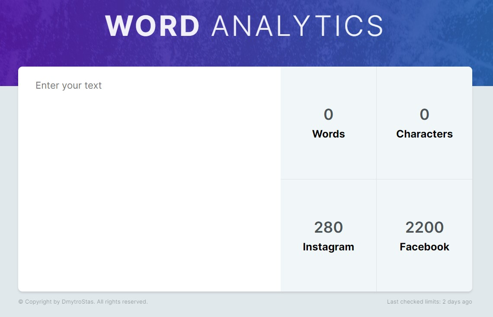

# Word Analytics

## Overview

Individual project

"Word Analytics" is a reliable assistant in the world of modern textual content. Use this app to efficiently count words in all your written content, from social media to corporate documents. Avoid exceeding character limits and keep your content to the optimal length for maximum effectiveness. With a word counter, you'll always have control over some characters in your posts before publishing, ensuring the maximum impact of your message on your audience. Be sure of every word with "Word Analytics"!

## Features

- Easy to use
- Responsive design for optimal viewing on different devices

## Technologies Used

##

> Developed by Dmytro Stas

